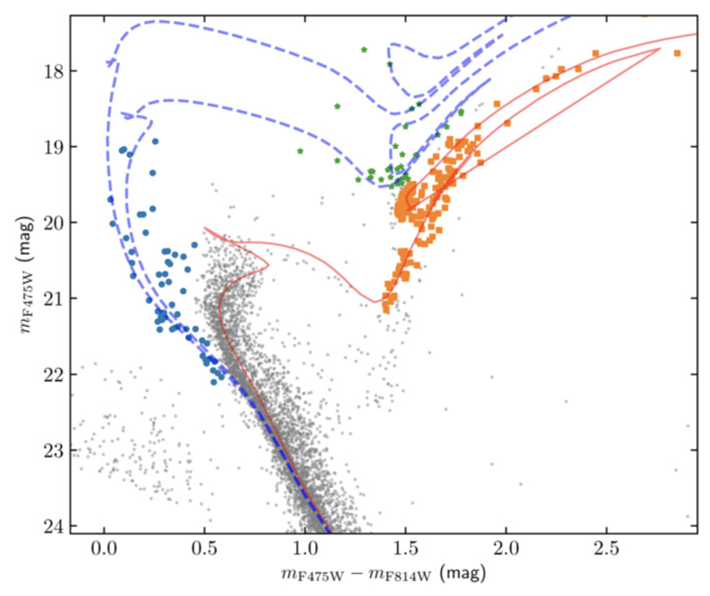
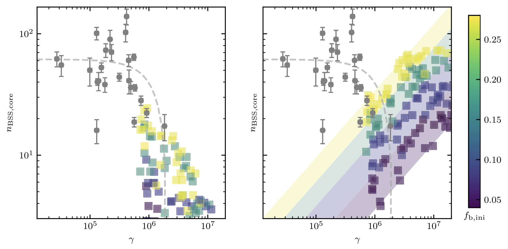
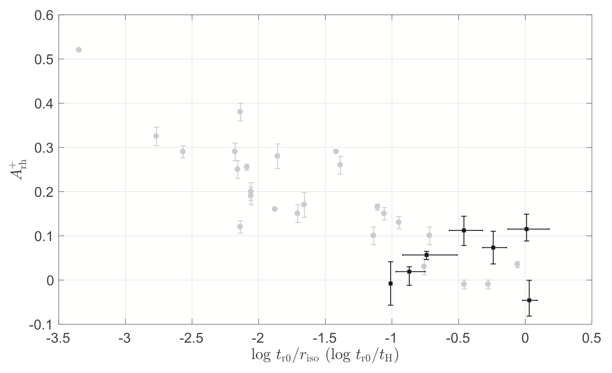

Blue straggler stars (BSSs) are brighter and bluer than the main-sequence turnoff (MSTO) in a given star cluster, yet they occupy the extrapolation of a cluster’s main sequence as defined by its bulk stellar population. 

The prevailing scenarios for the formation of BSSs involve direct collisions of single stars and/or binary systems, or mass transfer and/or the coalescence of primordial binaries. However, the distinction between both formation channels is not as clear-cut in real environments.

In this [paper](https://ui.adsabs.harvard.edu/abs/2018ApJ...862..133S/abstract), we analyze 24 clusters in the MCs. We uncover a sublinear correlation between the number of BSSs in the cluster cores and the clusters’ core masses, with a power-law index of 0.49 ± 0.09. The mass-normalized number of BSSs is only weakly dependent on the mass-normalized collision parameter and, for higher collision rates, it decreases with increasing collision parameter, clearly indicating the predomi- nance of binary disruption. Therefore, we conclude that the formation of the observed BSSs is likely dominated by binary mechanisms, at least in most of our sample clusters.

Although the framework describing how BSSs can probe the dynamical processes of their host stellar systems has been well studied for Galactic GCs, whether our understanding of BSSs would also hold for their younger, extragalactic counterparts remains unclear.

In the subsequent paper, we study seven LMC massive clusters with ages from 1 Gyr to 7 Gyr. We examine whether the BSS mass segregation degrees could be applied to measure the dynamical states of their host clusters. The effects of (small-)number dispersions of the BSSs and of field contamination are carefully explored by employing a Monte-Carlo-based statistical examination. We find that our result is generally consistent with the empirical relationship for Galactic GCs.

