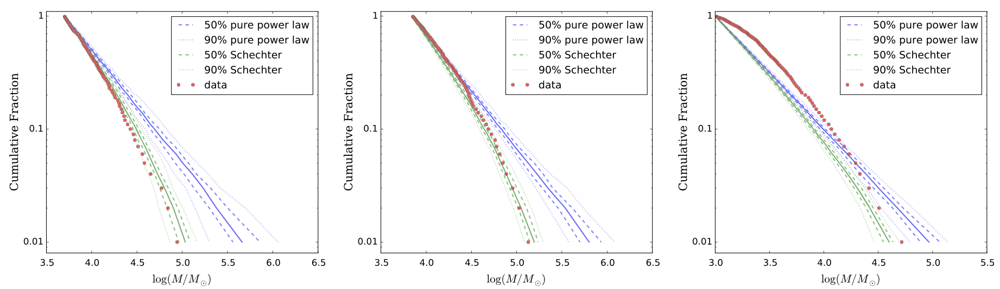
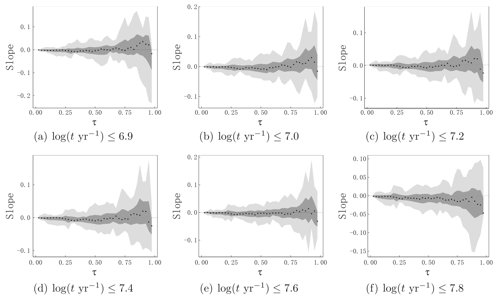

Whether or not the initial star cluster mass function is established through a universal, galactocentric-distance-independent stochastic process, on the scales of individual galaxies, remains an unsolved problem. 

Here, [we](https://ui.adsabs.harvard.edu/abs/2016ApJ...816....9S/abstract) revisit the evidence in favor and against stochastic cluster formation by examining the young (< a few 100 million year old) star cluster mass– galactocentric radius relation in M33, M51, M83, and the Large Magellanic Cloud. We conduct the analysis through an application of quantile regression, a binless approach to rank-based regression taking an absolute-value-distance penalty. Both methods yield, within the 1σ to 3σ uncertainties, near-zero slopes in the diagnostic plane, largely irrespective of the maximum age or minimum mass imposed on our sample selection, or of the radial bin size adopted. We conclude that, at least in our four well-studied sample galaxies, star cluster formation does not necessarily require an environment-dependent cluster formation scenario, which thus supports the notion of stochastic star cluster formation as the dominant star cluster-formation process within a given galaxy.

