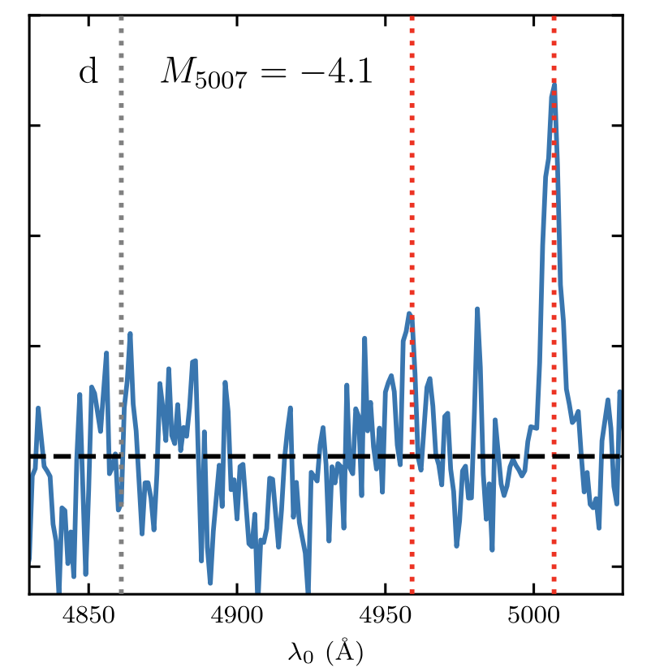
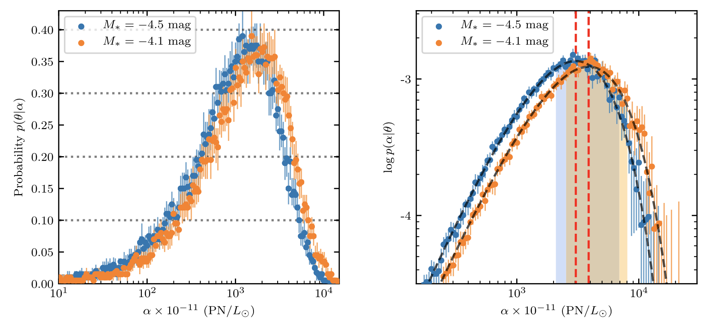

Despite of decades of research, the stellar population that forms planetary nebulae (PNe) is still not clear. Traditionally, PNe are thought to be the circumstellar gas ejected from extreme giant stars at the end of the asymptotic giant branch (AGB) phase, accompanied with an intense mass loss.

Globular clusters (GCs) provide a unique environment to test this scenario. The evolutionary timescale of old populations stars (like those in GCs) is longer than 100 kyr for a low-mass core; thus, any remnant ejected at the end of the AGB phase would have dispersed before the CS gets hot enough to ionize the expelled gas, making it impossible to form any PNe. The binary-interaction model may provide a plausible explanation because a common- envelope interaction or even a stellar merger, which is favored by GCs’ high-density environment, will accelerate the evolu- tionary process and likely form a PN with low-mass CSs.

We report a systematic spectroscopic survey for the [O III] 5007 Å emission line of PNe in 1469 Virgo GCs and 121 Virgo ultra-compact dwarfs (UCDs), mainly hosted in the giant elliptical galaxies M87, M49, M86, and M84. We detected zero PNe in our UCD sample and discovered one PN associated with an M87 GC.

The luminosity-specific frequency of PNe in the Virgo GCs is among the lowest reported in any environment, due in part to the large sample size, and it is 5–6 times lower than that for the Galactic GCs. We suggest that the frequency decreases toward brighter and more massive clusters, sharing a similar trend as the binary fraction, and the discrepancy between the Virgo and Galactic GCs can be explained by the observational bias in extragalactic surveys toward brighter GCs. This low but nonzero efficiency in forming PNe may highlight the important role played by binary interactions in forming PNe in GCs. 

