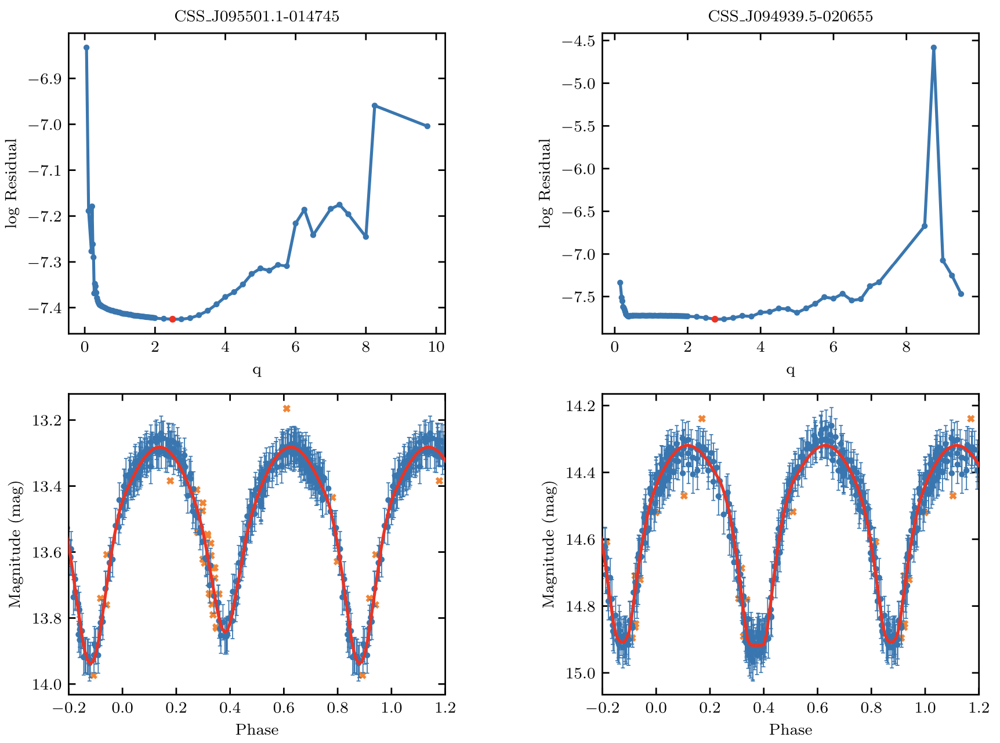
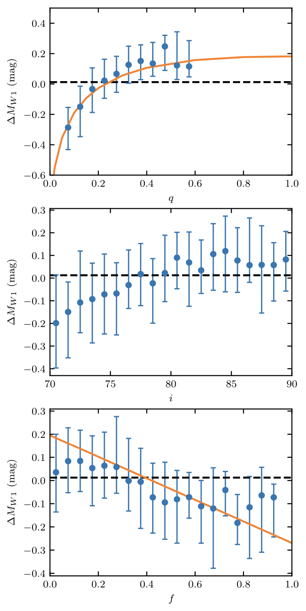

The sample of known contact binariess (CBs) was recently significantly increased thanks to new data from several sky surveys that provide high-cadence, long-term, high-precision photometric observations in a range of passbands. However, most previous studies dealing with large samples of CBs were limited to analyses of their light-curve morphology (e.g., periods and amplitudes), which is rather different from deriving the intrinsic properties of the stellar components. 

[We](https://ui.adsabs.harvard.edu/abs/2020ApJS..247...50S/abstract) develop an automated Wilson–Devinney-type code to derive physical parameters from the CB light curves, and we apply our method to a large CB sample from the CSS Data Release 1. Armed with distance information obtained from PLR analysis in infrared passbands, we can estimate the intrinsic properties— masses, radii, and luminosities—of 2335 CBs.

W-type CBs are clearly located in a strip in the total mass versus mass-ratio plane, while A-type CBs may exhibit a slightly different dependence. There are no significant differences among the PLRs of A- and W-type CBs, but the PLR zero-points are affected by their mass ratios and fill-out factors. Determination of zero-point differences for different types of CBs may help us improve the accuracy of the resulting PLRs. We demonstrate that automated approaches to deriving CB properties could be a powerful tool for application to the much larger CB samples expected to result from future surveys.

