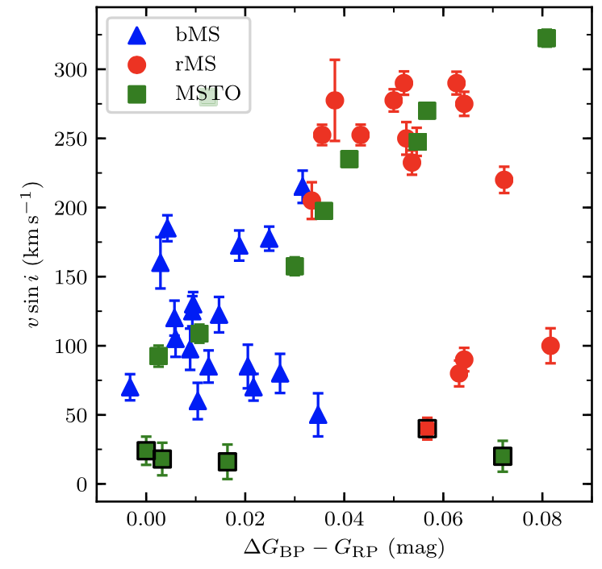
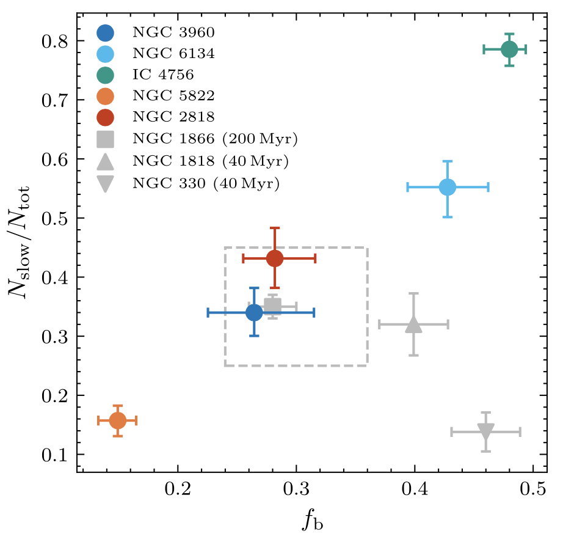

Over the last decade, one of the most intriguing discoveries in star clusters is the discovery of extended main-sequence turnoff (eMSTO) and the split main sequence. In the color-magnitude diagrams, the MS in these clusters presents an extended profile around the turnoff region or a bifurcation along the main sequence. This unexpected finding poses a fundamental challenge to our traditional understanding of star clusters as "single stellar populations."

Stellar rotation is a very promising scenario behind these phenomena. At a rotation velocity of several hundred kilometers per second, the star would not keep spherical, but it would elongate along the equator and flatten to be an ellipsoid. As the equator area gets further from the reaction core and thus becoming cooler, while the polar region will become hotter. This "gravity darkening" effect is known to change the star's loci on the color-magnitude diagram effectively. 

In our [first work](https://ui.adsabs.harvard.edu/abs/2019ApJ...876..113S/abstract), we tried to answer this question: <b>"Whether stellar rotation rates is the reason for extended main-sequence turnoff found in intermediate-age clusters?" </b>. We present a spectroscopic survey of MSTO stars in a nearby, intermediate-age (0.9 Gyr), low-mass Galactic open cluster, NGC 5822, using medium-resolution Southern African Large Telescope spectra and find that the loci of the main-sequence stars in the eMSTO region show a clear correlation with the projected rotational velocities in the sense that fast rotators are located on the red side of the eMSTO and slow rotators are found on the blue side. This is one of the first work suggesting that that stellar rotation is the main cause of the eMSTO in the intermediate-age clusters.

Then we looked into another young cluster NGC 2287, which hosts a well-separated double MS to address this problem: <b>"Does split MS originates from stellar rotation dichotomy? If true, what causes the rotation distribution?"</b>. [We](https://ui.adsabs.harvard.edu/abs/2019ApJ...883..182S/abstract) find out the double MS is tightly correlated with a dichotomous distribution of stellar rotation rates and our observations may reflect the effects of tidal locking affecting a fraction of the cluster’s member stars in stellar binary systems.

The impact of stellar rotation on the morphology of star cluster colour–magnitude diagrams is widely acknowledged. However, the physics driving the distribution of the equatorial rotation velocities of MSTO stars is as yet poorly understood. To answer <b>"Is the rotation rates in star clusters regulated by the same mechanism? Whether we can distinguish different formation scenario for the observed rotation distribution?" </b>, [we](https://ui.adsabs.harvard.edu/abs/2021MNRAS.502.4350S/abstract) studied five intermediate-age open clusters and discovered a tight correlation between the number ratio of slow rotators and the clusters’ binary fractions. The blue-main-sequence stars in at least two of our clusters are more centrally concentrated than their red-main-sequence counterparts, suggesting a binary-driven formation mechanism.

