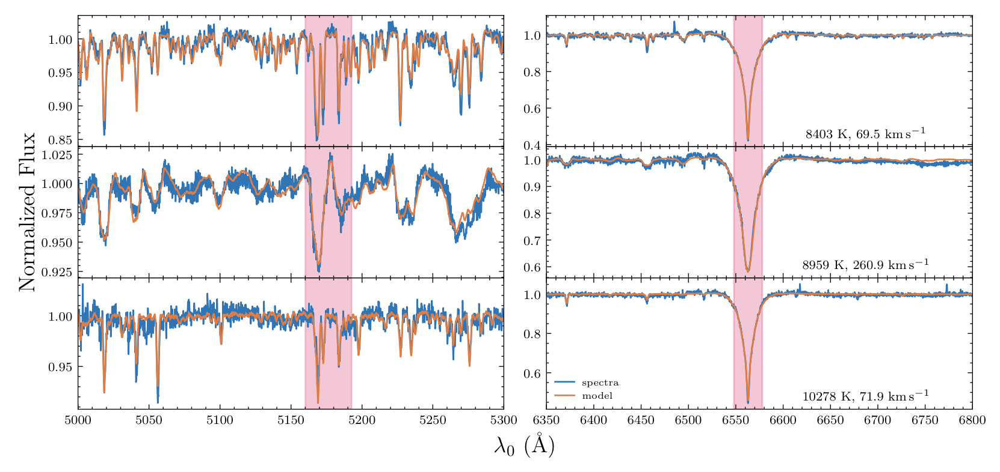
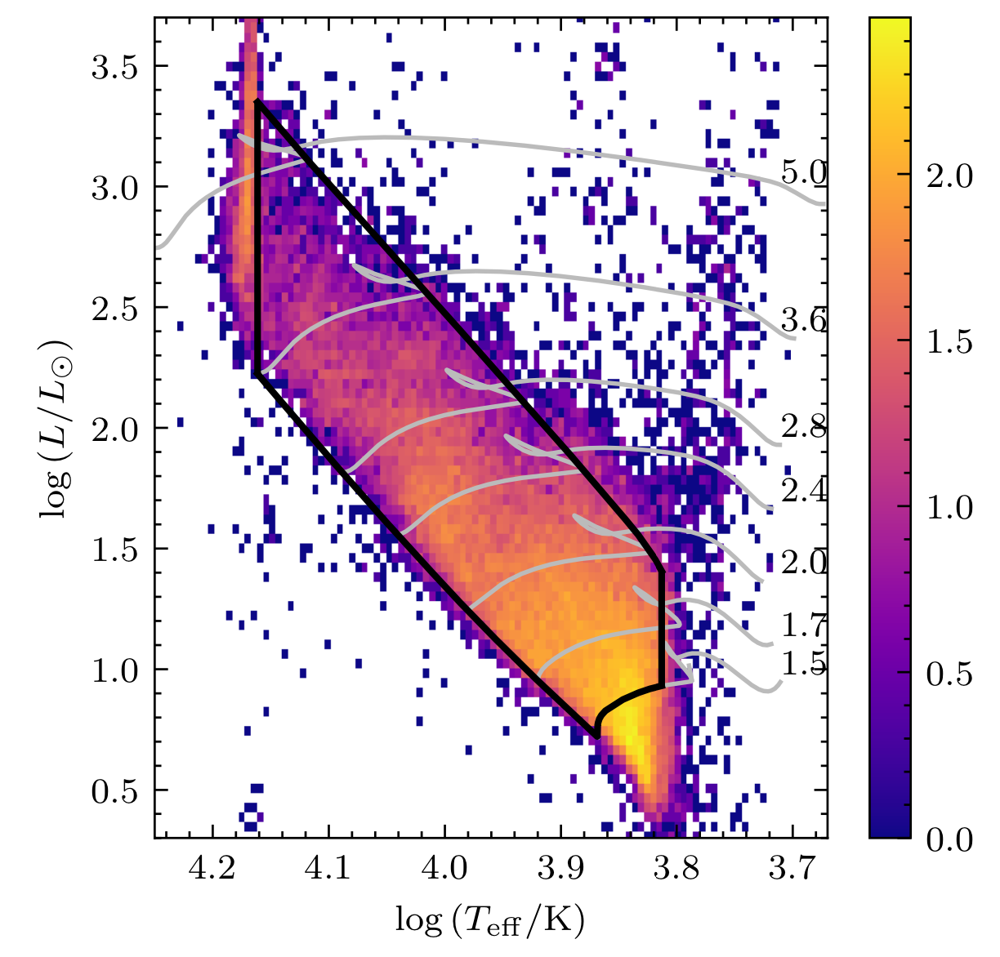
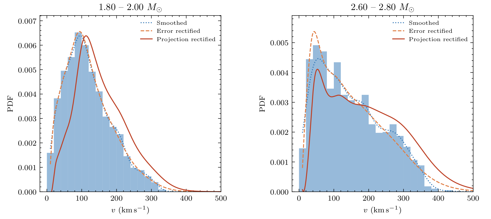
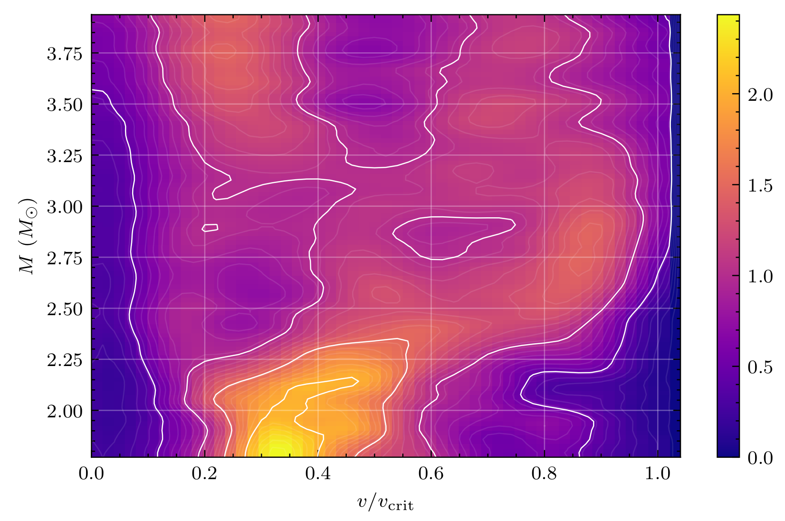
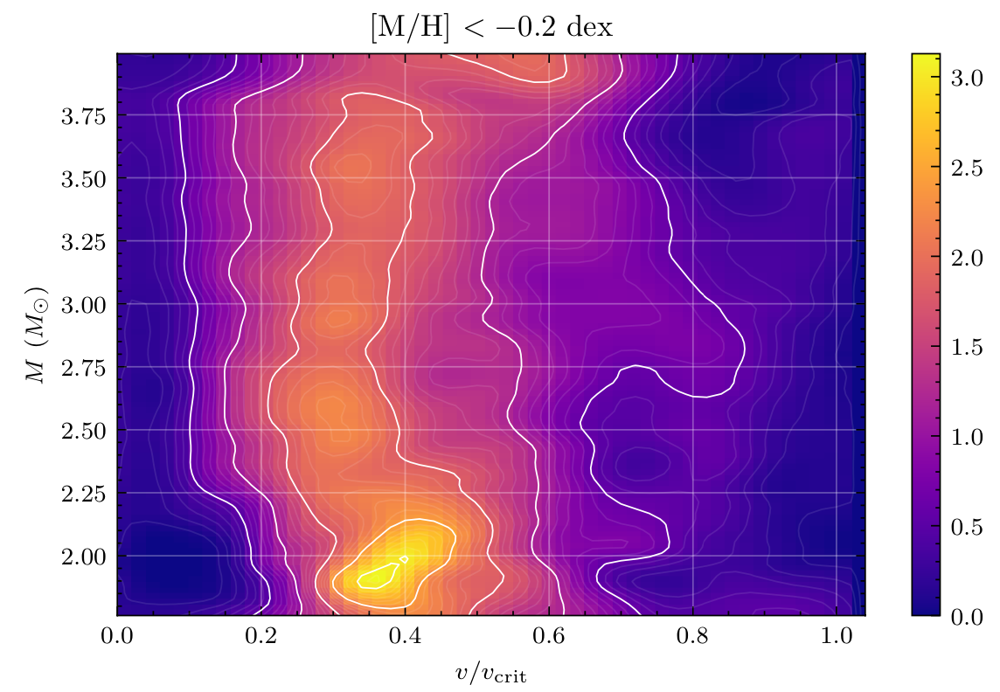
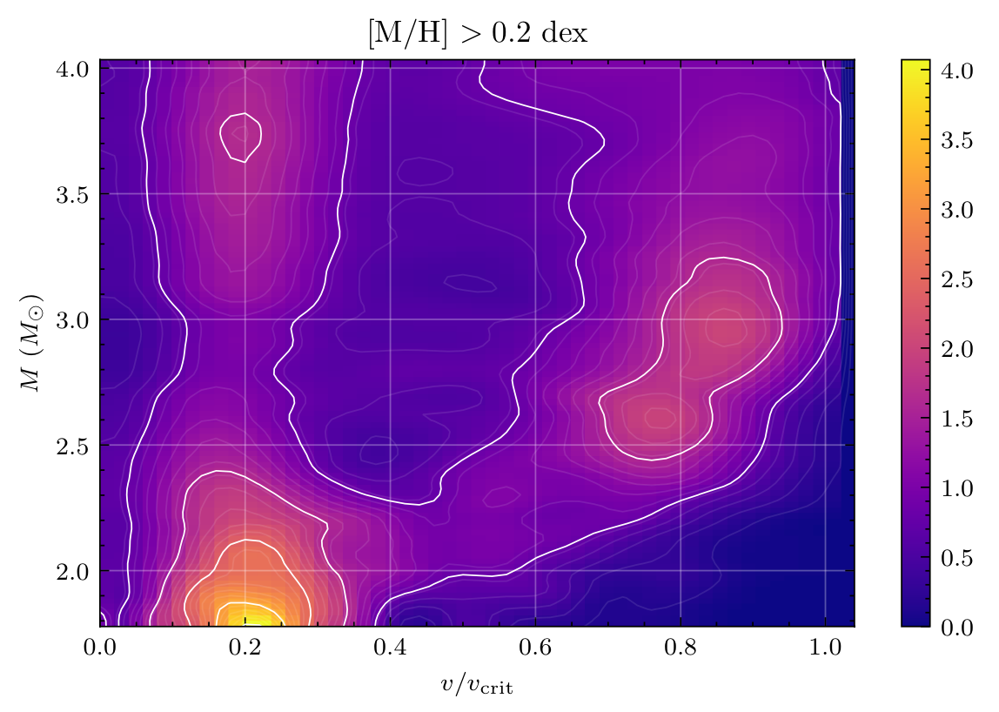

Early-type stars comprise hot, massive, and luminous stars of spectral types O, B, A, and early-F. They are short- lived and rare compared with late-type dwarfs, which are less massive. Most early-type stars have significantly higher rotation rates than solar-type and low-mass stars. due to their higher initial angular momenta, shorter contraction timescales to the zero-age main sequence (ZAMS), lack of deep convective envelopes, and strong magnetic fields (except for chemically peculiar stars).

Precise and accurate stellar parameters derived from stellar spectra are necessary to understand early-type stars. To derive stellar ‘labels’ (stellar parameters and abundances), common practice is to match stellar spectra and model templates using Balmer and metal lines. In recent years, machine-learning algorithms have been introduced, which have proved efficient in processing large databases. 

In the [first paper](https://ui.adsabs.harvard.edu/abs/2021arXiv210801212S/abstract) of this series, we undertake a survey of early-type stars in LAMOST DR7, based on a sample size that is more than ten times larger than the previously largest database. We construct a data-driven model for medium- resolution spectra based on the SLAM model trained by ATLAS12 atmospheric models. We compile a catalog composed of more than 40,000 stars with effective temperatures of 7000 K < Teff < 14,500 K and derive their stellar labels (Teff , log g, \[M/H\], and v sin i) and fundamental parameters (masses and ages).

In the [seond work](https://ui.adsabs.harvard.edu/abs/2021arXiv210801213S/abstract), we review the statistical properties of their stellar rotation rates using our catalog of 40,034 early-type stars with homogeneous vsini parameters.

Upon correction for projection effects and rectification of the error distribution, we derive the distributions of our sample’s equatorial rotation velocities, which show a clear dependence on stellar mass. Stars with masses less than 2.5 M⊙ exhibit a unimodal distribution, with the peak velocity ratio increasing as stellar mass increases. A bimodal rotation distribution, composed of two branches of slowly and rapidly rotating stars, emerges for more massive stars (M > 2.5M).

For the first time, we find that metal-poor (\[M/H\] < −0.2 dex) stars only exhibit a single branch of slow rotators, while metal-rich (\[M/H\] > 0.2 dex) stars clearly show two branches. The difference could be attributed to unexpectedly high spin-down rates and/or in part strong magnetic fields in the metal-poor subsample.

